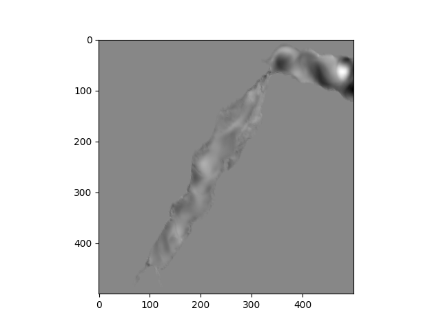
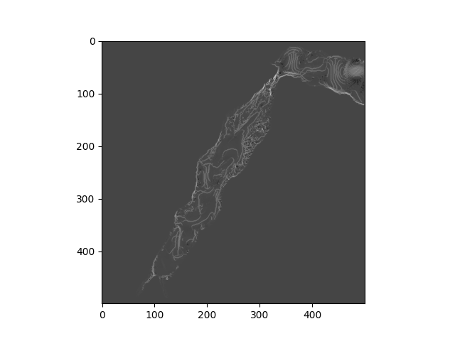
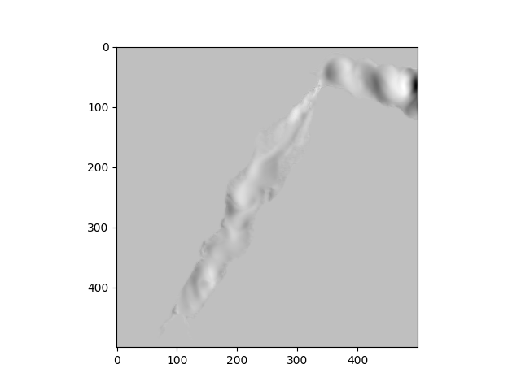
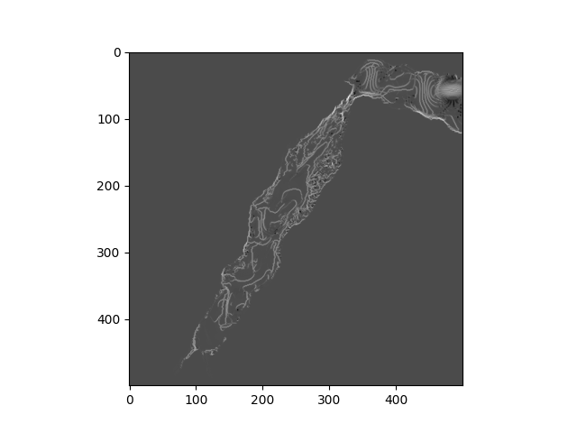

<h1>Introduction:</h1>

- This is a project attempts to implement on LSTM on FTLE

<a herf="https://www.youtube.com/watch?v=lveOu7jLNh0&t=1673s" >what is and how to computation of FTLE?</a>
 
<a herf="https://www.youtube.com/watch?v=6niqTuYFZLQ&list=PL3FW7Lu3i5JvHM8ljYj-zLfQRF3EO8sYv&index=10"> what is LSTM?</a>
 
 
<a herf="mailto:doubizhandouji@gmail.com">Contact me:</a>
 
<a herf="mailto:doubizhandouji@gmail.com">doubizhandouji@gmail.com</a>
 
<a herf="mailto:chens356@mcmaster.ca"> chens356@mcmaster.ca</a>

The author first used the FTLE computation in LCS folder, then used the LSTM in CNN folder to 
learn the results. Here are some rough results:

The margin of error measured by MSE is about 0.01, which is not bad, Therefore the absolute
difference between the calculated value to the real value is about 0.1, considering the data range is roughly between +1.2 to -0.5,
the error is estimated about only 5%-15% for the entire graph. The image is an visualization of the Data, does not demonstrate the real
error, since the colors are guided by matplotlib and I honestly have no idea what is going on there.

<h2>How to use:</h2>

For those of you who wants to train the model, I will post the data shortly
However, due to alot of the factors I can not post the data right now.
 
The LSTM is designed to support 500*500 input data, if any other size, you may want to consider
interpolate your input to reduce or increase size.
 
the run.py file in CNN is CLI supported, you can use it to train the model with custom dataSet
it is not fully tuned yet, If anyone is using it which I imagine no one will, please contact me or start an issue

<h3>PS:</h3>

You will See the paper on Arxiv within 2 weeks of time, I will post the link here when it arrives.

